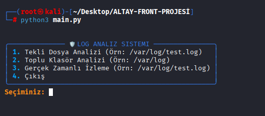
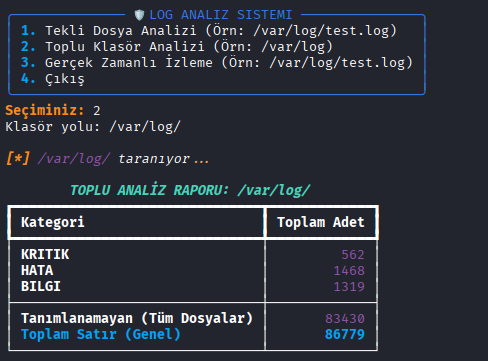
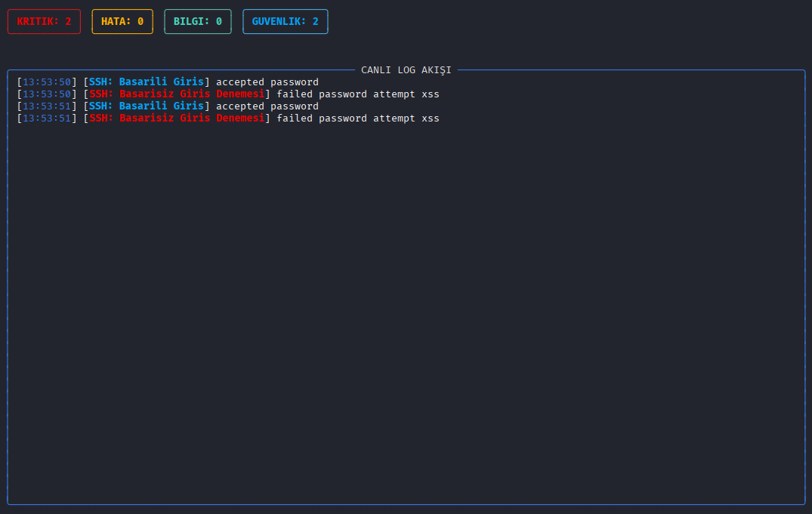

# CLI Tabanlı Log Analiz ve Uyarı Aracı

Bu proje, siber güvenlik uzmanlarının ve siber güvenlik meraklılarının, belirlediği log dosyalarını analiz edebilmeleri için tasarlanmış CLI tabanlı log analizi ve uyarı aracıdır.

## Uygulama Görüntüleri

### 1. Ana Menü ve Kullanıcı Arayüzü
Uygulama, kullanıcı dostu bir TUI (Terminal User Interface) ile açılır.


### 2. Detaylı Log Analiz Raporu
Tekli veya toplu analizlerde tüm kategoriler ile eşleşen veriler ve aynı zamanda kategorize edilemeyen tüm veriler sunulur.


### 3. Canlı Log İzleme (Real-time Tail)
Bölünmüş ekran tasarımıyla anlık istatistikler ve log akışı takip edilebilir.


## Çalışma Mantığı (Architecture)
Sistem üç temel katmandan oluşmaktadır:
1. **Veri Toplama:** Python'ın `os.walk` ve `tail -f` metodları ile `/var/log` gibi girilen dosya yolu altındaki veriler okunur.
2. **Analiz Motoru:** `rules.json` içinde tanımlanan anahtar kelimeler, her bir log satırı ile eşleştirilir. Anlık olarak canlı izleme veya stabil dosya, klasör analizi yapılır. 
3. **Raporlama ve Uyarı:** Yakalanan bulgular `Rich` kütüphanesi ile TUI (Terminal User Interface) üzerinden kullanıcıya sunulur ve eş zamanlı olarak `outputs/` klasörüne kaydedilir.

## Tespit Edilen Güvenlik Olayları
Uygulama, varsayılan kural seti ile aşağıdaki kritik olayları anlık olarak raporlar:
- **Web Saldırıları:** SQL Injection (`union select`), XSS (`<script>`), Directory Traversal.
- **Sistem Sızmaları:** Başarısız SSH girişleri (`failed password`), Sudo yetki hataları.
- **Adli Analiz:** SQLMap, Nmap gibi saldırgan araçlarının ayak izleri.
- **Sistem Sağlığı:** Kernel panikleri, disk doluluk oranları, bellek yetersizliği hataları.

## Raporlama Standartları
Tüm analiz çıktıları, olay süreçlerine uygun olarak `outputs/` dizininde saklanır:
- **Format:** CSV (Excel ve SIEM uyumlu)
- **İsimlendirme:** `rapor_GG_AA_YYYY_SAAT.csv`
- **Sütunlar:** Zaman, Kategori, Etiket, Dosya Yolu, Mesaj.

## Yeni Kural Ekleme (Özelleştirme)
Sistemin analiz kapasitesini artırmak için rules.json dosyasına dilediğiniz kadar yeni kural ekleyebilirsiniz. Her kural şu yapıda olmalıdır:

```JSON
{
  "keyword": "log_içinde_aranacak_kelime",
  "label": "Görünecek Uyarı Mesajı",
  "kategori": "KRITIK, HATA, BILGI veya GUVENLIK"
}
```

## Docker Kullanımı
Uygulamanın taşınabilirliğini sağlamak adına Docker imajı hazırlanmıştır.

### Kurulum (Build)
```bash
docker build -t cli-log-analizi-uyari-araci .
```

### Çalıştırma (Run)
Sistem loglarına erişim yetkisiyle başlatmak için:
```bash
docker run -it --rm -v /var/log:/var/log cli-log-analizi-uyari-araci
```

## Yerel Çalıştırma Gereksinimleri
Uygulamayı Docker olmadan, doğrudan kendi işletim sisteminizde çalıştırmak isterseniz aşağıdaki gereksinimleri karşılamanız yeterlidir:

Python Sürümü: Python 3.10 veya üzeri.

Bağımlılıkların Kurulumu: Proje klasöründeyken gerekli kütüphaneleri (Rich) yüklemek için şu komutu çalıştırın:

```Bash
pip install -r requirements.txt
```

## 👤 Geliştirici
- **Ad Soyad:** [Meriç Aytaş]
- **Linkedin:** [https://www.linkedin.com/in/mericaytas/]